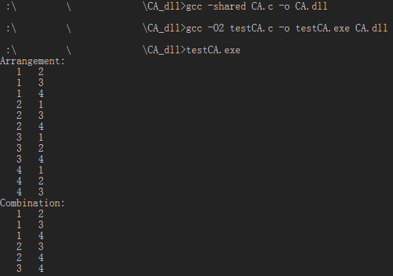

#排列组合的库
##TDM-GCC 生成动态链接库并调用
ps:以下为release版本的编译，debug版本加-g3参数（生成gdb专用的调试信息，其他的google吧）
###生成动态链接库
gcc -c CA.c -o CA.o  
gcc -shared CA.o -o CA.dll
####或者
gcc -shared CA.c -o CA.dll
###生成测试程序
gcc testCA.c -o testCA.exe CA.dll
###测试
testCA.exe
***

##GCC 生成静态链接库并调用
###生成静态连接库
gcc -c CA.c CA.h  
ar -r libCA.a CA.h.gch CA.o
###生成测试程序
gcc testCA.c -o testCA.out libCA.a
###测试
./testCA.out

##GCC 生成动态链接库并调用
gcc -c -fPIC CA.c CA.h  
gcc -shared CA.o -o libCA.so
####或者
gcc -shared -fPIC CA.c CA.h -o libCA.so
###生成测试程序
gcc testCA.c -o testCA.out libCA.so
###测试(拷贝.so文件或者设置LD_LIBRARY_PATH)
./testCA.out
